# LazyTask Helper Guide

## General Guidelines

- Always use descriptive variable names, e.g. `customerName` instead of `name`
- Don't fix typescript errors with 'any' type, use the correct type instead
- Always use `uv` no `requirements.txt` or `poerty`
- Always try to use a declarative approach. Have config objects etc.
- Use declarative programming where possible, e.g. use config objects and `map`, `filter`, `reduce` instead of `forEach`
- Fail fast with descriptive messages
- Include context for debugging
- Handle errors at appropriate level
- Never silently swallow exceptions

- Test behavior, not implementation
- One assertion per test when possible
- Clear test names describing scenario
- Use existing test utilities/helpers
- Tests should be deterministic

**NEVER**:

- Use `--no-verify` to bypass commit hooks
- Disable tests instead of fixing them
- Make assumptions - verify with existing code

- Follows domain-driven design principles
- Domain-driven design: Keep domain logic in domain/, use dependency
  injection and keep concrete implementations in infrastructure/

## Project Specific

Inspect the Reminder CLI submodule and see which functionalities are available there.

Always run the app through `uv`.

I want to build an application that can be a terminal interface for me to
work with task management. In this repository you find a sub-module for the
Reminder CLI to handle Apple Reminders. I want to build this application in
a way that it is agnostic to the actual backend. Meaning you need to have an
abstract class with the interfaces to enable all of the functionalities and
features outlined in this document that we need. The concrete implementation
should be an adapter to the Reminder CLI and needs to implement all of
these functions. In order to test this application well, create a mock
backend task management and use that always. Never communicate directly with
the Reminder CLI. Always assume that the list that you're working on is
called "develop".

Keep a checklist of what you did and what your status is. So next time we can continue where we left of

### Features that I need

- [x] Integrate swift adapter to make this app work with apple reminders.
      See https://github.com/florianbellmann/reminders-cli.git
      The adapter will build to a binary executable. the app should be able to talk to that binary
      Dont try to build the reminders cli. Just read the swift source code to understand how it works
- [x] Adding a task by title
- [x] Completing a task
- [x] Switching between lists
- [x] Edit dates
- [x] Move to tomorrow
- [x] Edit full card form
- [x] Edit descriptions
- [x] Edit tags
- [x] Edit prios
- [x] Edit flags
- [x] Refresh list
- [x] Handling of all tasks, not only overdue
- [x] Sorting / filtering
- [x] Async task handling with busy spinners, maybe add command queue
- [x] Fix help pages initial app functionalities
- [x] Display of further infos: Tags, recurring, flags, prios, ...
- [x] Github actions, building, tests and linting
- [x] Input hardening
- [ ] recurring tasks handling
- [x] Implement app logging for debugging

### Example repos that I like

- Lazygit
- Lazydocker

And this app:

```python
"""
Optimized Mermaid TUI Application Module
======================================

High-performance version of the main application with async processing.

Performance Features:
- Async rendering pipeline to prevent UI blocking
- Background diagram generation with progress indicators
- Optimized component coordination
- Smart caching integration
- Enhanced responsiveness during heavy operations

Author: Claude Code AI Assistant
"""

# Core Python imports for async operations, encoding, and file handling
import asyncio  # For asynchronous operations
import base64  # For encoding image data
import contextlib  # For context management utilities
import json  # For JSON data handling
import os  # For environment and OS operations
import shutil  # For file operations and executable detection
from typing import TYPE_CHECKING, Any, Callable, Dict, List, Optional, Tuple

# Rich library for text formatting
from rich.text import Text

# Textual TUI framework imports
from textual.app import App as TextualApp  # Main application class
from textual.app import ComposeResult  # For compose method return type
from textual.binding import Binding  # For keyboard bindings
from textual.containers import (  # Layout containers
    Container,
    Horizontal,
    ScrollableContainer,
    Vertical,
)
from textual.message import Message  # For custom messages
from textual.screen import ModalScreen  # For modal dialogs
from textual.widgets import Button, Footer, Input, Label, Static

from models.messages import StreamType  # UI widgets

# Import mermaid renderer with TYPE_CHECKING guard for better mypy compatibility
if TYPE_CHECKING:
    from mermaid_renderer_optimized import OptimizedMermaidRenderer
else:
    from mermaid_renderer_optimized import OptimizedMermaidRenderer

__all__ = ["App"]


class TerminalImageDisplay:
    """Utility class for displaying images across different terminal emulators.

    This class provides cross-platform image display functionality that works
    with various terminal emulators including Kitty, iTerm2, WezTerm, Ghostty,
    and generic terminals using tools like chafa.
    """

    @staticmethod
    def detect_terminal() -> str:
        """Detect the current terminal emulator based on environment variables.

        Returns:
            str: Terminal type identifier (kitty, iterm, wezterm, ghostty, or generic)
        """
        # Check environment variables that indicate terminal type
        term_program = os.environ.get(
            "TERM_PROGRAM", "" 
        ).lower()  # Primary terminal identifier
        term = os.environ.get("TERM", "").lower()  # TERM environment variable

        # Check specific terminal identifiers (most specific first)
        if "ghostty" in term_program:
            return "ghostty"  # Ghostty terminal emulator
        elif "iterm" in term_program:
            return "iterm"  # iTerm2 terminal emulator
        elif "apple_terminal" in term_program:
            return "iterm"  # Use iterm protocol for macOS Terminal too
        elif term == "xterm-kitty" or os.environ.get("KITTY_WINDOW_ID"):
            return "kitty"  # Kitty terminal emulator
        elif "wezterm" in term_program or os.environ.get("WEZTERM_EXECUTABLE"):
            return "wezterm"  # WezTerm terminal emulator

        # Only use fallback detection if no specific terminal was detected
        # This prevents misdetection when you have multiple terminals installed
        print(
            f"🔍 No specific terminal detected (TERM_PROGRAM='{os.environ.get('TERM_PROGRAM', 'not set')}', TERM='{os.environ.get('TERM', 'not set')}')"
        )
        print("🔍 Trying fallback detection...")

        # Try to detect available image display tools
        if shutil.which("chafa"):
            print("🔍 Using chafa as fallback image viewer")
            return "generic"  # Will use chafa in fallback
        elif shutil.which("wezterm"):
            return "wezterm"  # WezTerm available as fallback
        elif shutil.which("kitty"):
            return "kitty"  # Kitty available as fallback
        else:
            return "generic"  # Use generic fallback methods

    @staticmethod
    async def display_image(
        image_path: str, width: Optional[int] = None, height: Optional[int] = None
    ) -> bool:
        """Display an image in the terminal using the appropriate method.

        This method automatically detects the terminal type and uses the
        most appropriate image display protocol for that terminal.

        Args:
            image_path: Path to the image file to display
            width: Optional width constraint (may not be supported by all terminals)
            height: Optional height constraint (may not be supported by all terminals)

        Returns:
            bool: True if image was displayed successfully, False otherwise
        """
        # Detect the current terminal type
        terminal = TerminalImageDisplay.detect_terminal()

        try:
            # Route to appropriate display method based on terminal type
            if terminal == "kitty":
                return await TerminalImageDisplay._display_kitty(
                    image_path, width, height
                )
            elif terminal == "iterm":
                # Use iTerm2's inline image protocol
                return await TerminalImageDisplay._display_iterm(
                    image_path, width, height
                )
            elif terminal == "wezterm":
                # Use WezTerm's imgcat utility
                return await TerminalImageDisplay._display_wezterm(
                    image_path, width, height
                )
            elif terminal == "ghostty":
                # Use Ghostty's image display capabilities
                return await TerminalImageDisplay._display_ghostty(
                    image_path, width, height
                )
            else:
                # Use fallback methods for unknown terminals
                return await TerminalImageDisplay._display_fallback(
                    image_path, width, height
                )
        except Exception as e:
            # Log any errors in image display
            print(f"Error displaying image: {e}")
            return False

    @staticmethod
    async def _display_kitty(
        image_path: str, width: Optional[int], height: Optional[int]
    ) -> bool:
        """Display image using kitty's image protocol.

        Uses the kitty terminal's built-in icat kitten for image display.

        Args:
            image_path: Path to the image file
            width: Optional width in columns
            height: Optional height in rows

        Returns:
            bool: True if image displayed successfully
        """
        try:
            # Build kitty icat command
            cmd = ["kitty", "+kitten", "icat"]
            if width:
                cmd.extend(["--cols", str(width)])  # Set width in terminal columns
            if height:
                cmd.extend(["--rows", str(height)])  # Set height in terminal rows
            cmd.append(image_path)  # Add image file path

            # Execute the kitty icat command asynchronously
            result = await asyncio.create_subprocess_exec(*cmd)
            await result.wait()  # Wait for command completion
            return result.returncode == 0  # Return success based on exit code
        except Exception:
            # Return False if any error occurs
            return False

    @staticmethod
    async def _display_iterm(
        image_path: str, width: Optional[int], height: Optional[int]
    ) -> bool:
        """Display image using iTerm2's inline image protocol.

        Uses iTerm2's proprietary escape sequence protocol for inline images.

        Args:
            image_path: Path to the image file
            width: Optional width parameter
            height: Optional height parameter

        Returns:
            bool: True if image displayed successfully
        """
        try:
            # Read and encode image file as base64
            with open(image_path, "rb") as f:
                image_data = base64.b64encode(f.read()).decode("ascii")

            # Build iTerm2 inline image protocol parameters
            width_param = f"width={width}" if width else ""  # Width parameter
            height_param = f"height={height}" if height else ""  # Height parameter
            params = ";".join(filter(None, [width_param, height_param]))
            if params:
                params = ";" + params  # Add separator if params exist

            # Send iTerm2 escape sequence for inline image display
            print(f"\033]1337;File=inline=1{params}:{image_data}\007")
            return True
        except Exception:
            # Return False if any error occurs (file read, encoding, etc.)
            return False

    @staticmethod
    async def _display_wezterm(
        image_path: str, width: Optional[int], height: Optional[int]
    ) -> bool:
        """Display image using wezterm's imgcat utility.

        Uses WezTerm's built-in imgcat command for image display.

        Args:
            image_path: Path to the image file
            width: Optional width constraint
            height: Optional height constraint

        Returns:
            bool: True if image displayed successfully
        """
        try:
            # Build wezterm imgcat command
            cmd = ["wezterm", "imgcat"]
            if width:
                cmd.extend(["--width", str(width)])  # Set width constraint
            if height:
                cmd.extend(["--height", str(height)])  # Set height constraint
            cmd.append(image_path)  # Add image file path

            # Execute the wezterm imgcat command asynchronously
            result = await asyncio.create_subprocess_exec(*cmd)
            await result.wait()  # Wait for command completion
            return result.returncode == 0  # Return success based on exit code
        except Exception:
            # Return False if any error occurs
            return False

    @staticmethod
    async def _display_ghostty(
        image_path: str,
        width: Optional[int],  # noqa: ARG004
        height: Optional[int],  # noqa: ARG004
    ) -> bool:
        """Display image using ghostty's capabilities.

        Ghostty supports multiple image protocols. This method tries kitty's icat
        first, then falls back to the kitty image protocol escape sequences.

        Args:
            image_path: Path to the image file
            width: Optional width (not used due to protocol limitations)
            height: Optional height (not used due to protocol limitations)

        Returns:
            bool: True if image displayed successfully
        """
        try:
            # First try kitty icat if available (often works better in ghostty)
            if shutil.which("kitty"):
                try:
                    # Execute kitty icat command with output capture
                    result = await asyncio.create_subprocess_exec(
                        "kitty",
                        "+kitten",
                        "icat",
                        image_path,
                        stdout=asyncio.subprocess.PIPE,
                        stderr=asyncio.subprocess.PIPE,
                    )
                    await result.wait()  # Wait for command completion
                    if result.returncode == 0:
                        print()  # Add newline after kitty icat
                        return True
                except Exception:
                    # Silently continue to next method if kitty icat fails
                    pass

            # Try ghostty's kitty image protocol support
            with open(image_path, "rb") as f:
                # Read and encode image file as base64
                image_data = base64.b64encode(f.read()).decode("ascii")

            # Use kitty image protocol escape sequence which ghostty supports
            # Format: ESC_Gf=100,a=T,C=1;{base64_data}ESC\
            print(f"\033_Gf=100,a=T,C=1;{image_data}\033\", end="", flush=True)

            # Add proper termination and cursor positioning for ghostty
            print("\033[0m")  # Reset terminal attributes
            print()  # Move to next line

            return True
        except Exception:
            # If all ghostty methods fail, return False to trigger fallback
            return False

    @staticmethod
    async def _display_fallback(
        image_path: str,
        width: Optional[int],  # noqa: ARG004
        height: Optional[int],  # noqa: ARG004
    ) -> bool:
        """Fallback image display methods for unknown or generic terminals.

        Tries various image display utilities in order of preference until
        one succeeds or all fail.

        Args:
            image_path: Path to the image file
            width: Optional width (not used by most fallback methods)
            height: Optional height (not used by most fallback methods)

        Returns:
            bool: True if any method successfully displayed the image
        """
        # Try common image display programs in order of preference
        commands = [
            ["wezterm", "imgcat"],  # WezTerm's image display utility
            ["kitty", "+kitten", "icat"],  # Kitty terminal's icat
            ["imgcat"],  # Standalone imgcat if available
            ["chafa"],  # Text-based image viewer
            ["jp2a"],  # ASCII art converter
        ]

        # Try each command in order until one succeeds
        for cmd_base in commands:
            if shutil.which(cmd_base[0]):  # Check if command is available
                try:
                    cmd = cmd_base.copy()  # Create copy to modify

                    # Only add size constraints for text-based viewers that need them
                    if cmd_base[0] == "chafa":
                        # chafa benefits from size constraints to prevent huge output
                        cmd.extend(["--size", "80x40"])  # Reasonable terminal size
                    elif cmd_base[0] == "jp2a":
                        cmd.extend(["--width=80"])  # Reasonable width for ASCII art
                    # For wezterm and kitty, let them auto-size for best quality

                    cmd.append(image_path)  # Add image file path

                    # Execute the command asynchronously
                    result = await asyncio.create_subprocess_exec(*cmd)
                    await result.wait()  # Wait for completion
                    if result.returncode == 0:
                        return True  # Success! Image was displayed
                except Exception:
                    continue  # Try next command if this one fails

        # Final fallback: try chafa even if not found earlier (in case it exists but wasn't detected)
        try:
            result = await asyncio.create_subprocess_exec(
                "chafa",
                "--size",
                "80x40",  # Set reasonable display size
                image_path,
                stdout=asyncio.subprocess.PIPE,  # Capture output
                stderr=asyncio.subprocess.PIPE,  # Capture errors
            )
            stdout, _ = await result.communicate()  # Get output
            if result.returncode == 0:
                print(stdout.decode("utf-8"))  # Print text representation
                return True
        except Exception:
            pass  # Continue to next fallback

        # Absolute last resort: try any chafa variant at common paths
        for chafa_cmd in ["chafa", "/usr/bin/chafa", "/usr/local/bin/chafa"]:
            try:
                result = await asyncio.create_subprocess_exec(
                    chafa_cmd,
                    "--size",
                    "80x40",  # Set reasonable display size
                    image_path,
                    stdout=asyncio.subprocess.PIPE,  # Capture output
                    stderr=asyncio.subprocess.PIPE,  # Capture errors
                )
                stdout, _ = await result.communicate()  # Get output
                if result.returncode == 0:
                    print(stdout.decode("utf-8"))  # Print text representation
                    print(f"\n💡 Displayed using {chafa_cmd} (text-based viewer)")
                    return True
            except Exception:
                continue  # Try next chafa variant

        # If truly all else fails, just show the path and installation suggestions
        print(f"📁 Image file: {image_path}")
        print(
            "   💡 Install chafa for text-based image viewing: brew install chafa / apt install chafa"
        )
        print("   💡 Or install high-quality viewers: wezterm, kitty")
        return False  # Could not display image with any method


class SocketCommunicator:
    """Class for managing socket communication with the server.

    This class handles TCP socket connections to the backend server,
    manages message sending/receiving, and supports real-time streaming
    of responses from AI agents.
    """

    def __init__(
        self,
        host: str = "localhost",
        port: int = 8080,
        user_id: str = "default_user",
    ) -> None:
        """Initialize the socket communicator.

        Args:
            host: Server hostname (default: localhost)
            port: Server port number (default: 8080)
            user_id: Unique identifier for this user
        """
        self.host = host  # Server hostname
        self.port = port  # Server port number
        self.user_id = user_id  # User identifier
        self.conversation_id: Optional[str] = None  # Conversation ID for this session
        self.reader: Optional[Any] = None  # AsyncIO stream reader
        self.writer: Optional[Any] = None  # AsyncIO stream writer
        self.connected = False  # Connection status flag
        self._listener_task: Optional[Any] = None  # Background listener task
        self._streaming_callback: Optional[Callable[[Dict[str, Any]], Any]] = (
            None  # Streaming message handler
        )

    async def connect(self) -> None:
        """Establish connection to the socket server.

        Creates TCP connection and sets up reader/writer streams.

        Raises:
            ConnectionError: If connection to server fails
        """
        try:
            # Establish async TCP connection to server
            self.reader, self.writer = await asyncio.open_connection(
                self.host, self.port
            )
            self.connected = True  # Mark connection as established
        except Exception as e:
            # Wrap connection errors with more context
            raise ConnectionError(
                f"Failed to connect to {self.host}:{self.port}: {e}"
            ) from e

    async def send_message(self, message: str) -> Dict[str, Any]:
        """Send a user message to the server.

        This method sends a message to the server and sets up streaming
        response handling. All responses are delivered via the streaming callback.

        Args:
            message: The user message to send

        Returns:
            Dict indicating streaming mode is active

        Raises:
            ConnectionError: If connection to server fails
        """
        # Ensure we're connected to the server
        if not self.connected:
            await self.connect()

        # Build request message structure
        request = {
            "type": "user_message",  # Message type identifier
            "content": message,  # User's message content
            "user_id": self.user_id,  # User identifier
            "timestamp": asyncio.get_event_loop().time(),  # Current timestamp
        }

        # Include conversation_id if we have one from a previous exchange
        if self.conversation_id:
            request["conversation_id"] = self.conversation_id

        try:
            # Start background listener for streaming messages FIRST
            if not self._listener_task or self._listener_task.done():
                # Create background task to listen for server messages
                self._listener_task = asyncio.create_task(
                    self._listen_for_streaming_messages()
                )
                # Give listener a moment to start up
                await asyncio.sleep(0.01)

            # Send the JSON request to server
            request_json = json.dumps(request) + "\n"
            if self.writer:
                self.writer.write(request_json.encode())  # Write encoded JSON
                await self.writer.drain()  # Ensure data is sent

            # Return status indicating streaming mode is active
            # All actual responses will come through the streaming callback
            return {"status": "streaming_mode"}

        except Exception:
            # Mark connection as failed and re-raise exception
            self.connected = False
            raise

    async def _listen_for_streaming_messages(self) -> None:
        """Background listener for streaming messages from agents.

        This method runs continuously in the background to receive and
        process streaming messages from the server. It calls the registered
        callback for each valid message received.
        """
        # Keep listening while connected and reader is available
        while self.connected and self.reader:
            try:
                if self.reader:
                    # Read one line from server (messages are line-delimited)
                    data = await self.reader.readline()
                else:
                    break  # No reader available

                if not data:
                    break  # Connection closed by server

                # Decode and process the message
                response_str = data.decode().strip()
                if response_str and self._streaming_callback:
                    try:
                        # Parse JSON response and call callback
                        response = json.loads(response_str)
                        await self._streaming_callback(response)
                    except json.JSONDecodeError:
                        # Ignore malformed JSON messages
                        pass
            except Exception:
                # Break on any error to prevent infinite loops
                break

    async def _handle_streaming_response(self, response: Dict[str, Any]) -> None:
        """Handle streaming responses - to be overridden by app.

        This is a placeholder method that should be replaced by the application
        with actual streaming response handling logic.

        Args:
            response: The response message from the server
        """
        # This is a placeholder - the app should provide a callback
        pass

    async def get_user_history(self) -> Dict[str, Any]:
        """Retrieve user conversation history from the server.

        Makes a synchronous request to get the user's conversation history.
        This is not streamed like regular messages.

        Returns:
            Dict containing user's conversation history

        Raises:
            ConnectionError: If connection to server fails
        """
        # Ensure we're connected to the server
        if not self.connected:
            await self.connect()

        # Build history request message
        request = {
            "type": "get_user_history",  # Request type
            "content": "",  # No content needed
            "user_id": self.user_id,  # User identifier
            "timestamp": asyncio.get_event_loop().time(),  # Current timestamp
        }

        # Include conversation_id if we have one
        if self.conversation_id:
            request["conversation_id"] = self.conversation_id

        try:
            # Send the history request to server
            request_json = json.dumps(request) + "\n"
            if self.writer:
                self.writer.write(request_json.encode())  # Send encoded JSON
                await self.writer.drain()  # Ensure data is sent

            # Read synchronous response (history requests don't stream)
            if self.reader:
                data = await self.reader.readline()  # Read response line
                response_str = data.decode().strip()  # Decode to string
                response: Dict[str, Any] = json.loads(response_str)  # Parse JSON
                return response
            else:
                return {}  # Return empty dict if no reader

        except Exception:
            # Mark connection as failed and re-raise
            self.connected = False
            raise

    def set_streaming_callback(self, callback: Callable[[Dict[str, Any]], Any]) -> None:
        """Set the callback function for handling streaming messages.

        The callback will be called for each streaming message received from the server.

        Args:
            callback: Async function to call with each streaming response
        """
        self._streaming_callback = callback

    async def close(self) -> None:
        """Close the socket connection and clean up resources.

        Cancels the background listener task and closes the TCP connection.
        """
        # Cancel the background listener task if it's running
        if self._listener_task and not self._listener_task.done():
            self._listener_task.cancel()

        # Close the TCP connection
        if self.writer:
            self.writer.close()  # Close the writer
            await self.writer.wait_closed()  # Wait for close to complete
            self.connected = False  # Mark as disconnected


class UserIdDialog(ModalScreen[Optional[str]]):  # type: ignore[misc]
    """A modal dialog for changing the user ID.

    This dialog allows users to change their user identifier, which affects
    how their messages are stored and retrieved from the server.
    """

    DEFAULT_CSS = """
    UserIdDialog {
        align: center middle;
    }

    #dialog {
        width: 50;
        height: 10;
        border: round cyan;
        background: $surface;
        padding: 1;
    }

    #current_user {
        width: 100%;
        text-align: center;
        margin: 0;
        color: $accent;
    }

    #user_id_input {
        width: 100%;
        border: round blue;
        margin: 1 0 0 0;
    }

    #buttons {
        width: 100%;
        height: 3;
        margin: 1 0 0 0;
        align: center middle;
    }

    Button {
        border: round;
        margin: 0 2;
        min-width: 8;
        max-width: 10;
        background: transparent;
    }
    """

    def __init__(self, current_user_id: str) -> None:
        super().__init__()
        self.current_user_id = current_user_id

    def compose(self) -> ComposeResult:
        with Vertical(id="dialog") as dialog:
            dialog.border_title = "🆔 Change User ID"
            yield Label(f"Current: {self.current_user_id}", id="current_user")
            yield Input(
                placeholder="Enter new User ID...", value="", id="user_id_input"
            )
            with Horizontal(id="buttons"):
                yield Button("OK", id="ok_button")
                yield Button("Cancel", id="cancel_button")

    def on_mount(self) -> None:
        """Focus the input field when dialog opens."""
        self.query_one("#user_id_input", Input).focus()

    def on_button_pressed(self, event: Button.Pressed) -> None:
        """Handle button presses."""
        if event.button.id == "ok_button":
            self._submit_dialog()
        else:
            self.dismiss(None)

    def _submit_dialog(self) -> None:
        """Submit the dialog with validation."""
        user_input = self.query_one("#user_id_input", Input)
        new_user_id = user_input.value.strip()

        if (
            new_user_id
            and len(new_user_id) > 0
            and new_user_id.replace("_", "").replace("-", "").isalnum()
        ):
            self.dismiss(new_user_id)
        elif new_user_id:
            user_input.value = ""
            user_input.placeholder = "Invalid ID! Use letters, numbers, _, -"
        else:
            self.dismiss(None)

    def on_input_submitted(self, event: Input.Submitted) -> None:  # noqa: ARG002
        """Handle Enter key in input field."""
        self._submit_dialog()

    def on_key(self, event: Any) -> None:
        """Handle key events."""
        if event.key == "escape":
            self.dismiss(None)


class ChatInterface(ScrollableContainer):  # type: ignore[misc]
    """A chat interface widget for displaying user and system messages.

    Features:
    - User messages displayed in green boxes
    - System messages displayed in yellow boxes
    - Auto-scroll to latest messages
    - External content injection support
    - Message history management
    - Status messages with animations
    """

    # Custom message event for triggering renders
    class RenderRequest(Message):  # type: ignore[misc]
        """Message to request rendering of markdown content."""

        def __init__(self, content: str) -> None:
            super().__init__()
            self.content = content

    # Custom message event for user input submission
    class UserMessageSubmitted(Message):  # type: ignore[misc]
        """Message indicating user submitted a message for external processing."""

        def __init__(self, message: str) -> None:
            super().__init__()
            self.message = message

    def __init__(self, **kwargs: Any) -> None:
        """Initialize the chat interface."""
        super().__init__(**kwargs)
        self.messages: List[
            Tuple[str, str]
        ] = []  # List of (message_type, content) tuples
        # Status will be integrated into the chat display
        self.current_status: Optional[str] = None  # Current status message
        self.status_animation_frame: int = 0  # Animation frame counter
        self.status_timer: Optional[Any] = None  # Timer for status animation
        # Streaming message tracking
        self.active_streaming_message: Optional[str] = (
            None  # Current streaming message content
        )
        self.streaming_message_id: Optional[str] = (
            None  # ID of current streaming message
        )

    def compose(self) -> ComposeResult:
        """Compose the chat interface with Panel containing scrollable content."""
        # Main chat display with scrollable content inside the panel
        with ScrollableContainer(id="chat_scroll") as chat_scroll:
            chat_scroll.border_title = "💬 Gandalv Conversation"
            self.chat_display: Static = Static(
                "Welcome to Gandalv!\n\nType a message below and press Enter to chat.\n\nPress Ctrl+L to change your User ID.",
                id="chat_content",
            )
            yield self.chat_display

        # Input field at bottom with blue border
        with Container(id="input_container"):
            self.input_field: Input = Input(
                placeholder="Type your message here...", id="input_field"
            )
            yield self.input_field

    def add_user_message(self, message: str) -> None:
        """Add a user message to the chat (green box)."""
        self.messages.append(("user", message))
        self.update_display()

    def add_system_message(self, message: str) -> None:
        """Add a system message to the chat (yellow box)."""
        self.messages.append(("system", message))
        self.update_display()

    def add_breakout_message(self, message: str) -> None:
        """Add a breakout node message to the chat (red box)."""
        self.messages.append(("breakout", message))
        self.update_display()

    def start_streaming_message(self, stream_id: str) -> None:
        """Start a new streaming message."""
        self.streaming_message_id = stream_id
        self.active_streaming_message = ""
        self.messages.append(("streaming", ""))
        self.update_display()

    def add_to_streaming_message(self, content: str) -> None:
        """Add content to the current streaming message."""
        if self.active_streaming_message is not None:
            if self.active_streaming_message:
                self.active_streaming_message += "\n" + content
            else:
                self.active_streaming_message = content
            # Update the last message (which should be the streaming one)
            if self.messages and self.messages[-1][0] == "streaming":
                self.messages[-1] = ("streaming", self.active_streaming_message)
            self.update_display()

    def update_streaming_message_content(self, content: str) -> None:
        """Update the streaming message with complete new content (replaces existing)."""
        if self.active_streaming_message is not None:
            # Replace the entire content with the new complete state
            self.active_streaming_message = content
            # Update the last message (which should be the streaming one)
            if self.messages and self.messages[-1][0] == "streaming":
                self.messages[-1] = ("streaming", self.active_streaming_message)
            self.update_display()

    def finish_streaming_message(self) -> None:
        """Finish the current streaming message and convert to regular system message."""
        if self.active_streaming_message is not None:
            # Replace the streaming message with a final system message
            if self.messages and self.messages[-1][0] == "streaming":
                self.messages[-1] = ("system", self.active_streaming_message)
            self.active_streaming_message = None
            self.streaming_message_id = None
            self.update_display()

    def add_system_status(self, message: str) -> None:
        """Add an animated status message at the bottom of the chat."""
        self.current_status = message
        self.status_animation_frame = 0

        # Clear any existing timer
        if self.status_timer:
            self.status_timer.cancel()

        # Immediately update display and force scroll for new status
        self.update_display()
        self._force_scroll_bottom()

        # Start animation
        self._update_status_animation()

        # Set up animation timer
        import asyncio

        self.status_timer = asyncio.create_task(self._animate_status())

    def clear_system_status(self) -> None:
        """Clear the current status message."""
        self.current_status = None
        if self.status_timer:
            self.status_timer.cancel()
            self.status_timer = None
        # Update display to remove status
        self.update_display()

    def add_system_markdown(self, markdown: str) -> None:
        """Add system markdown content and trigger render."""
        self.add_system_status("Generating markdown content")
        # Trigger markdown rendering in right panel
        self.post_message(self.RenderRequest(markdown))

        self.clear_system_status()

    async def on_input_submitted(self, event: Input.Submitted) -> None:  # noqa: ARG002
        """Handle user input submission - delegate to parent app."""
        user_message = event.value.strip()
        if not user_message:
            return

        # Clear input field
        self.input_field.value = ""

        # Add user message to chat
        self.add_user_message(user_message)

        # Post message to parent app for external system handling
        self.post_message(self.UserMessageSubmitted(user_message))

    async def handle_external_system_communication(self, user_message: str) -> None:
        """Handle communication with external system."""
        # INJECT CHAT CONTENT HERE
        # This is where external systems should process the user message and respond
        # Example implementation with animated status:

        # Show thinking status with animation
        self.add_system_status("Thinking...")
        await asyncio.sleep(1)  # Simulate processing time

        # Here you would integrate with your external system
        # For now, this is a demo that shows different response types

        if "mermaid" in user_message.lower() or "diagram" in user_message.lower():
            # Update status for diagram generation
            self.add_system_status("Generating diagram...")
            await asyncio.sleep(1)  # Simulate diagram generation

            # Clear status and show result
            self.clear_system_status()
            markdown_content = self.generate_sample_mermaid_response(user_message)
            self.add_system_markdown(markdown_content)

        elif "hello" in user_message.lower():
            self.clear_system_status()
            self.add_system_message(
                "Hello! I can help you create diagrams and markdown content."
            )
        else:
            # Show processing status
            self.add_system_status("Preparing response...")
            await asyncio.sleep(0.8)

            # Clear status and show response
            self.clear_system_status()
            response = f"I received your message: '{user_message}'\n\nLet me show you a sample diagram."
            self.add_system_message(response)

            # Show diagram generation status
            self.add_system_status("Creating sample diagram...")
            await asyncio.sleep(1)

            # Generate sample markdown with diagram
            self.clear_system_status()
            sample_markdown = self.generate_sample_mermaid_response("sample")
            self.add_system_markdown(sample_markdown)

    def generate_sample_mermaid_response(self, user_input: str) -> str:
        """Generate a sample mermaid response based on user input."""
        if "flowchart" in user_input.lower():
            return """
# Flowchart Diagram

```mermaid
flowchart TD
    A[Start] --> B{User Input}
    B -->|Process| C[Generate Response]
    C --> D[Display Result]
    D --> E[End]
````

Here's your requested flowchart!
"""
elif "sequence" in user_input.lower():
return """

# Sequence Diagram

```mermaid
sequenceDiagram
    participant U as User
    participant S as System
    participant E as External API

    U->>S: Send Message
    S->>E: Process Request
    E-->>S: Return Response
    S-->>U: Display Result
```

Here's your sequence diagram!
"""
else:
return """

# System Architecture

```mermaid
graph TB
    User[👤 User] --> Chat[💬 Chat Interface]
    Chat --> System[🤖 External System]
    System --> API[🔌 API Integration]
    API --> Response[📝 Response]
    Response --> Render[🖼️ Markdown Render]
```



This shows how the chat system works!
"""

    def inject_markdown_content(self) -> str:
        """Injection point for external markdown content."""
        # INJECT MARKDOWN CONTENT HERE
        # This is where external systems should provide markdown content for rendering
        # Return the markdown string that should be rendered in the right panel
        return """

# Sample Mermaid Diagram


This content comes from an external system.
"""

    def update_display(self) -> None:
        """Update the chat display with current messages and status."""
        # Get available width from the chat container with multiple fallback attempts
        container_width = 60  # Default fallback

        try:
            # First try to get from the chat scroll container
            chat_container = self.query_one("#chat_scroll", ScrollableContainer)
            if hasattr(chat_container, "size") and chat_container.size.width > 0:
                container_width = chat_container.size.width
            else:
                # Try to get from parent app
                app = self.app  # pyright: ignore[reportUnknownVariableType, reportUnknownMemberType]
                if hasattr(app, "size") and app.size.width > 0:  # pyright: ignore[reportUnknownArgumentType]
                    # Use half the app width (since chat is 50% in CSS)
                    container_width = app.size.width // 2
        except Exception:
            pass  # Use fallback

        max_box_width = max(
            20, int(container_width * 0.75) - 4
        )  # Leave space for borders and alignment

        rendered = Text()

        # Render all messages
        for msg_type, content in self.messages:
            if msg_type == "user":
                # User message with vibrant green box - right aligned
                rendered.append("\n")
                self._render_message_box(
                    rendered,
                    content,
                    "User",
                    "bright_green",
                    max_box_width,
                    container_width,
                    align_right=True,
                )

            elif msg_type == "system":
                # System message with vibrant yellow box - left aligned
                rendered.append("\n")
                self._render_message_box(
                    rendered,
                    content,
                    "System",
                    "bright_yellow",
                    max_box_width,
                    container_width,
                    align_right=False,
                )

            elif msg_type == "streaming":
                # Streaming message with cyan box and streaming indicator - left aligned
                rendered.append("\n")
                streaming_content = content if content else "..."
                self._render_message_box(
                    rendered,
                    streaming_content,
                    "System (streaming...)",
                    "bright_cyan",
                    max_box_width,
                    container_width,
                    align_right=False,
                )

            elif msg_type == "breakout":
                # Breakout node message with red box - left aligned
                rendered.append("\n")
                self._render_message_box(
                    rendered,
                    content,
                    "System (response required)",
                    "bright_red",
                    max_box_width,
                    container_width,
                    align_right=False,
                )

        # Add status at the bottom of chat if active
        if self.current_status:
            self._render_status_in_chat(rendered, container_width)

        # Add some padding at bottom if no messages yet
        if not self.messages and not self.current_status:
            rendered.append(
                "Welcome to the Chat Interface!\n\nType a message below and press Enter to chat."
            )

        # Update the content inside the scrollable container
        # The Panel will wrap the entire chat area from CSS
        content_widget = self.query_one("#chat_content", Static)
        content_widget.update(rendered)

        # Auto-scroll to bottom to show newest messages
        self._scroll_to_bottom()

    def _scroll_to_bottom(self) -> None:
        """Scroll the chat content to the bottom to show newest messages."""
        with contextlib.suppress(Exception):
            # Use call_after_refresh to ensure scroll happens after content update
            self.call_after_refresh(self._do_scroll)

    def _do_scroll(self) -> None:
        """Actually perform the scroll operation."""
        try:
            chat_container = self.query_one("#chat_scroll", ScrollableContainer)
            chat_container.scroll_end(animate=False)
        except Exception:
            pass

    def _render_status_in_chat(self, rendered: Text, container_width: int) -> None:
        """Render the status directly in the chat area with same sizing as message boxes."""
        if not self.current_status:
            return

        frame = self.status_animation_frame % 8
        spinners = ["⠋", "⠙", "⠹", "⠸", "⠼", "⠴", "⠦", "⠧"]
        spinner = spinners[frame]

        # Use same box sizing as user/system messages for consistency
        max_box_width = max(20, int(container_width * 0.8) - 4)  # Same as message boxes
        status_text = f"{spinner} {self.current_status}"

        # Render as a compact message box with same styling approach
        rendered.append("\n")
        self._render_status_box(rendered, status_text, spinner, max_box_width)

    def _render_status_box(
        self,
        rendered: Text,
        status_text: str,  # noqa: ARG002
        spinner: str,
        max_box_width: int,  # noqa: ARG002
    ) -> None:
        """Render a compact status box using the same logic as message boxes."""
        # Use same calculation approach as _render_message_box for consistency
        status_content = f"{spinner} {self.current_status}"

        # Calculate box width using same logic as message boxes
        content_width = len(status_content)
        header_width = len("Status") + 4  # "─ Status ─"
        needed_width = max(content_width, header_width)
        box_width = min(needed_width + 2, max_box_width)  # +2 for padding
        box_width = max(box_width, 25)  # Minimum readable width

        # Create top border with status label (similar to User/System)
        header = "─ Status "
        header_padding = "─" * (box_width - len(header) - 1)
        rendered.append(f"┌{header}{header_padding}┐", style="bold dim cyan")
        rendered.append("\n")

        # Render content with proper alignment
        content_space = box_width - 2  # Space for side borders

        # Status content line with spinner animation
        if len(status_content) <= content_space:
            # Content fits, pad to full width
            rendered.append(f"│ {spinner} ", style="dim cyan")
            rendered.append(f"{self.current_status}", style="italic white")
            remaining_space =
                content_space - len(status_content) - 1
            if remaining_space > 0:
                rendered.append(" " * remaining_space, style="dim")
            rendered.append("│", style="dim cyan")
        else:
            # Content too long, truncate
            truncated = status_content[: content_space - 4] + "..."
            rendered.append(f"│ {truncated:<{content_space}} │", style="dim cyan")
        rendered.append("\n")

        # Bottom border
        rendered.append(f"└{'─' * box_width}┘", style="bold dim cyan")
        rendered.append("\n")

    def _render_message_box(
        self,
        rendered: Text,
        content: str,
        sender: str,
        color: str,
        max_box_width: int = 50,
        container_width: int = 60,
        align_right: bool = False,
    ) -> None:
        """Render a properly formatted message box."""
        lines = content.split("\n")

        # Calculate box width using 80% of available space
        content_width = max(len(line) for line in lines) if lines else 0
        header_width = len(sender) + 4  # "─ User ─"
        needed_width = max(content_width, header_width)
        box_width = min(needed_width + 2, max_box_width)  # +2 for padding
        box_width = max(box_width, 20)  # Minimum readable width

        # Calculate alignment for right-aligned messages
        if align_right:
            # Dynamic right alignment - push message to the right side
            # Leave some margin on the right (about 10% of container)
            right_margin = max(2, int(container_width * 0.1))
            available_width = container_width - right_margin - 2  # -2 for borders
            left_padding = max(0, available_width - box_width)
            align_padding = " " * left_padding
        else:
            align_padding = ""

        # Create top border with sender name
        header = f"─ {sender} "
        header_padding = "─" * (box_width - len(header) - 1)
        rendered.append(
            f"{align_padding}┌{header}{header_padding}┐", style=f"bold {color}"
        )
        rendered.append("\n")

        # Render content lines with smart wrapping
        content_width = box_width - 2  # Space for borders and padding

        for line in lines:
            if not line.strip():  # Empty line
                rendered.append(f"{align_padding}│{' ' * box_width}│", style=color)
                rendered.append("\n")
            else:
                # Smart word wrapping for long lines
                while len(line) > content_width:
                    # Try to find a good break point (space or punctuation)
                    break_point = content_width
                    if " " in line[:content_width]:
                        # Find the last space within the limit
                        break_point = line.rfind(" ", 0, content_width)
                        if break_point == -1:
                            break_point = content_width

                    part = line[:break_point]
                    rendered.append(
                        f"{align_padding}│ {part:<{content_width}} │", style=color
                    )
                    rendered.append("\n")

                    # Continue with remaining text, skip leading space if we broke at a space
                    line = line[break_point:].lstrip()

                # Render remaining part
                if line:  # Only render if there's content left
                    rendered.append(
                        f"{align_padding}│ {line:<{content_width}} │", style=color
                    )
                    rendered.append("\n")

        # Bottom border
        rendered.append(f"{align_padding}└{'─' * box_width}┘", style=f"bold {color}")
        rendered.append("\n")

    def get_content(self) -> str:
        """Get current content for compatibility."""
        return self.inject_markdown_content()

    def on_mount(self) -> None:
        """Initialize the chat interface when mounted."""
        self.update_display()
        # Focus on input field for immediate typing
        self.input_field.focus()

    def update_user_id_display(self, user_id: str) -> None:
        """Update the chat interface to show the current user ID."""
        try:
            chat_scroll = self.query_one("#chat_scroll", ScrollableContainer)
            chat_scroll.border_title = f"💬 Gandalv Conversation (👤 {user_id})"
        except Exception:
            pass  # Ignore if widget not found

    def clear_chat_history(self) -> None:
        """Clear all messages from the chat."""
        self.messages = []
        self.current_status = None
        if self.status_timer:
            self.status_timer.cancel()
            self.status_timer = None
        self.update_display()

    def load_chat_history(self, history_messages: List[Tuple[str, str]]) -> None:
        """Load chat history from a list of (message_type, content) tuples."""
        self.messages = history_messages.copy()
        self.update_display()

    async def _animate_status(self) -> None:
        """Animate the status display with a moving progress bar."""
        try:
            while self.current_status:
                await asyncio.sleep(0.2)  # 200ms between frames
                self.status_animation_frame += 1
                self._update_status_animation()
        except asyncio.CancelledError:
            pass  # Animation was cancelled

    def _update_status_animation(self) -> None:
        """Update the status display animation frame and ensure scroll to bottom."""
        if not self.current_status:
            return
        # Update the display - the animation frame is used in _render_status_in_chat
        self.update_display()
        # Force scroll to bottom after status update to ensure visibility
        self.call_after_refresh(self._force_scroll_bottom)

    def _force_scroll_bottom(self) -> None:
        """Force scroll to bottom - more aggressive than normal scroll."""
        try:
            chat_container = self.query_one("#chat_scroll", ScrollableContainer)
            # Multiple attempts to ensure scrolling works
            chat_container.scroll_end(animate=False)
            chat_container.scroll_to(y=99999, animate=False)
            # Also schedule another scroll attempt slightly later
            self.call_after_refresh(lambda: self._final_scroll_attempt(chat_container))
        except Exception:
            pass  # Ignore errors

    def _final_scroll_attempt(self, chat_container: Any) -> None:
        """Final scroll attempt to ensure we reach the bottom."""
        with contextlib.suppress(Exception):
            chat_container.scroll_end(animate=False)

    def on_resize(self, event: Any) -> None:  # noqa: ARG002
        """Handle interface resize by redrawing chat content with new container size."""
        # Use timer to update after layout settles
        self.call_later(self._delayed_resize_update)

    def _delayed_resize_update(self) -> None:
        """Update display after resize with a small delay to ensure layout is settled."""
        self.update_display()
        # Also update status animation if active
        if self.current_status:
            self._update_status_animation()

class App(TextualApp[None]): # type: ignore[misc]
    """Optimized main TUI application with async processing.

    Performance improvements:
    - Async render request handling
    - Non-blocking diagram generation
    - Background processing with progress indicators
    - Enhanced responsiveness during operations
    """

    # CSS styling for fixed layout with clean scrolling
    DEFAULT_CSS = """
    #chat {
        width: 50%;
        height: 1fr;
    }

    #renderer {
        width: 50%;
        height: 1fr;
    }

    #chat_scroll {
        height: 1fr;
        overflow-y: auto;
        overflow-x: hidden;
        border: round cyan;
        scrollbar-size-vertical: 1;
    }

    #chat_content {
        padding: 1 2;
    }

    #input_container {
        height: 3;
        margin-top: 1;
        margin-bottom: 1;
        padding: 0;
    }

    #input_field {
        height: 1fr;
        border: round blue;
        margin: 0;
        padding: 0 1;
    }


    Horizontal {
        height: 100vh;
    }
    """

    # Available theme options
    THEMES: List[str] = [
        "textual-dark",
        "textual-light",
        "nord",
        "gruvbox",
        "monokai",
        "dracula",
    ]

    # Global key bindings
    BINDINGS = [
        Binding("q", "quit", "Quit"),
        Binding("ctrl+c", "quit", "Quit"),
        Binding("ctrl+i", "view_image", "View Images"),
        Binding("ctrl+t", "cycle_theme", "Theme"),
        Binding("ctrl+r", "force_refresh", "Force Refresh"),
        Binding("ctrl+l", "change_user_id", "Change User ID"),
        # Binding("ctrl+s", "show_stats", "Performance Stats"),  # New: show performance stats
    ]

    def __init__(self, **kwargs: Any) -> None:
        """Initialize the optimized application."""
        super().__init__(**kwargs)
        self.current_theme_index: int = 0
        self._render_lock: asyncio.Lock = asyncio.Lock()  # Prevent concurrent renders

        # User identification
        self.current_user_id: str = "default_user"  # Default user ID

        # Socket communication setup
        self.socket_client: Optional[SocketCommunicator] = (
            None  # Will hold socket connection
        )

        # Streaming state tracking
        self.active_streams: Dict[str, bool] = {}  # stream_id -> True/False

    def compose(self) -> ComposeResult:
        """Compose the application layout with optimized renderer."""
        with Vertical():
            with Horizontal():
                yield ChatInterface(id="chat")
                yield OptimizedMermaidRenderer(id="renderer")  # Use optimized renderer
            yield Footer()

    def on_mount(self) -> None:
        """Initialize the app when mounted."""
        # Update chat interface with initial user ID
        self.update_chat_user_id_display()
        # Load initial user history
        self.call_later(self.load_initial_history)

    async def on_chat_interface_render_request(
        self,
        message: ChatInterface.RenderRequest,
    ) -> None:
        """Handle render requests asynchronously to prevent blocking.

        Uses async processing to ensure the UI remains responsive during
        diagram generation and rendering operations.

        Args:
            message: Render request message containing content
        """
        # Prevent concurrent render operations
        async with self._render_lock:
            renderer = self.query_one("#renderer", OptimizedMermaidRenderer)

            # Show immediate feedback
            self.notify("Rendering content...", severity="information")

            try:
                # Use the optimized async render method
                await renderer.render_content_async(message.content)

                # Success notification
                if renderer.image_paths:
                    self.notify(
                        f"Rendered with {len(renderer.image_paths)} diagrams",
                        severity="information",
                    )
                else:
                    self.notify("Content rendered successfully", severity="information")

            except Exception as e:
                # Error handling with user feedback
                self.notify(f"Render error: {str(e)}", severity="error")

    async def action_force_refresh(self) -> None:
        """Force refresh the current content (bypass cache)."""
        chat = self.query_one("#chat", ChatInterface)
        renderer = self.query_one("#renderer", OptimizedMermaidRenderer)

        # Clear cache for fresh generation
        renderer.diagram_cache._cleanup_cache()  # pyright: ignore

        # Trigger re-render
        content = chat.get_content()
        if content.strip():
            self.notify("Force refreshing (bypassing cache)...", severity="information")
            await renderer.render_content_async(content)
            self.notify("Content force-refreshed", severity="information")
        else:
            self.notify("No content to refresh", severity="warning")

    async def action_view_image(self) -> None:
        """View images with async handling."""
        renderer = self.query_one("#renderer", OptimizedMermaidRenderer)
        if not renderer.image_paths:
            self.notify("No images generated yet. Render a mermaid diagram first.")
            return

        # Show progress for image loading
        self.notify(
            f"Loading {len(renderer.image_paths)} images...", severity="information"
        )

        # Suspend the app to show images in the terminal
        with self.suspend():
            await self._display_images_interactive(renderer.image_paths)

    async def _display_images_interactive(self, image_paths: List[str]) -> None:
        """Universal image viewing that works across different terminals.

        Supports:
        - kitty (kitty +kitten icat)
        - ghostty (kitty image protocol)
        - iTerm2/macOS Terminal (inline image protocol)
        - wezterm (imgcat command)
        - Fallback to text-based viewers (chafa, jp2a)

        Args:
            image_paths: List of paths to generated PNG images
        """
        current_index = 0
        total_images = len(image_paths)

        # Detect terminal once at the start
        terminal_type = TerminalImageDisplay.detect_terminal()

        while True:
            # Clear screen efficiently
            os.system("clear")
            current_path = image_paths[current_index]

            print(f"\n🖼️  Mermaid Image {current_index + 1} of {total_images}")
            print(f"🖥️  Terminal: {terminal_type}")
            print(f"📁 {current_path}\n")

            # Check for file existence
            if os.path.exists(current_path):
                # Try to display the image using the universal display system (no size constraints for best quality)
                success = await TerminalImageDisplay.display_image(current_path)

                # Add extra spacing for ghostty to prevent overlap
                if terminal_type == "ghostty":
                    print("\n\n")  # Extra spacing for ghostty
                elif success:
                    print()  # Single newline for other terminals

                if not success:
                    print("❌ Could not display image with any available method.")
                    print("💡 Try manually:")
                    print(f"   wezterm imgcat '{current_path}'")
                    print(f"   kitty +kitten icat '{current_path}'")
                    print(f"   chafa '{current_path}'")

            else:
                print("⚠️  Image file not found!")

            # Show enhanced navigation controls
            print(f"\n{'-' * 60}")
            if total_images > 1:
                print("Navigation: [n]ext, [p]revious, [1-9] jump to image, [q]uit")
                print(f"Currently viewing: {current_index + 1}/{total_images}")
            else:
                print("Press [q] to return to editor")
            print(f"{'-' * 60}")

            # Get user input with better error handling
            try:
                choice = input("Choice: ").strip().lower()
                if choice == "q" or choice == "":
                    break  # Return to editor
                elif choice == "n" and total_images > 1:
                    current_index = (current_index + 1) % total_images
                elif choice == "p" and total_images > 1:
                    current_index = (current_index - 1) % total_images
                elif choice.isdigit():
                    # Enhanced direct navigation
                    idx = int(choice) - 1
                    if 0 <= idx < total_images:
                        current_index = idx
                    else:
                        print(f"Invalid image number. Use 1-{total_images}")
                        await asyncio.sleep(1)  # Brief pause for user to see message
            except KeyboardInterrupt:
                break  # Handle Ctrl+C gracefully
            except ValueError:
                # Handle invalid input gracefully
                continue

    async def action_cycle_theme(self) -> None:
        """Cycle through themes with async handling."""
        self.current_theme_index = (self.current_theme_index + 1) % len(self.THEMES)
        new_theme = self.THEMES[self.current_theme_index]
        self.theme = new_theme
        self.notify(f"Theme: {new_theme}", severity="information")

        # Optional: Show theme preview briefly
        await asyncio.sleep(0.1)  # Brief delay for smooth transition

    async def action_show_stats(self) -> None:
        """Show performance statistics for diagram generation."""
        renderer = self.query_one("#renderer", OptimizedMermaidRenderer)
        stats_report = renderer.get_performance_stats()

        # Show stats in a notification or suspend to display in terminal
        if "No performance data" in stats_report:
            self.notify("No performance data available yet", severity="warning")
        else:
            # Suspend app to show detailed stats
            with self.suspend():
                os.system("clear")
                print("\n" + "=" * 60)
                print(stats_report)
                print("=" * 60)
                input("\nPress Enter to return to editor...")

                # Also show cache status
                cache_info = "\n📁 Cache Status:\n"
                cache_info += f"Location: {renderer.diagram_cache.cache_dir}\n"
                cache_files = list(renderer.diagram_cache.cache_dir.glob("*.png"))
                cache_info += f"Cached diagrams: {len(cache_files)}\n"
                if cache_files:
                    total_size = sum(f.stat().st_size for f in cache_files)
                    cache_info += f"Cache size: {total_size / (1024 * 1024):.1f} MB"

                print(cache_info)
                input("\nPress Enter to continue...")

                self.notify("Performance stats displayed", severity="information")

    async def action_change_user_id(self) -> None:
        """Change the current user ID with a popup dialog."""

        def handle_dialog_result(result: Optional[str]) -> None:
            if result and result != self.current_user_id:
                old_user_id = self.current_user_id
                self.current_user_id = result
                self.update_chat_user_id_display()
                self.notify(f"User ID changed to: {result}", severity="information")
                # Use call_later for async operation
                self.call_later(self.fetch_and_load_user_history, result, old_user_id)
            else:
                self.notify(f"User ID: {self.current_user_id}", severity="information")

        self.push_screen(UserIdDialog(self.current_user_id), handle_dialog_result)

    # External System Communication Methods
    async def on_chat_interface_user_message_submitted(
        self,
        message: ChatInterface.UserMessageSubmitted,
    ) -> None:
        """Handle user message submission from ChatInterface."""
        user_message = message.message
        await self._handle_user_message(user_message)

    async def _handle_user_message(self, user_message: str) -> None:
        """Handle user message with socket communication."""
        chat = self.get_chat_interface()

        try:
            # Show connecting status
            chat.add_system_status("Connecting to server...")

            # Create or reuse socket client
            if not self.socket_client:
                self.socket_client = SocketCommunicator(user_id=self.current_user_id)
                # Set up streaming callback
                self.socket_client.set_streaming_callback(self._handle_stream_message)
            else:
                # Update user ID in case it changed
                self.socket_client.user_id = self.current_user_id
                # Ensure callback is set
                self.socket_client.set_streaming_callback(self._handle_stream_message)

            # Send message and get response
            response = await self.socket_client.send_message(user_message)

            # All responses now come through the streaming handler
            if response.get("status") == "streaming_mode":
                # Messages will come through _handle_stream_message callback
                # Clear connecting status - responses will handle their own status
                chat.clear_system_status()
            elif response.get("status") == "error":
                chat.clear_system_status()
                chat.add_system_message(
                    f"❌ Error: {response.get('error', 'Unknown error')}"
                )

        except Exception as e:
            chat.clear_system_status()
            chat.add_system_message(f"❌ Connection error: {str(e)}")

            # Reset socket client on error
            if self.socket_client:
                with contextlib.suppress(Exception):
                    await self.socket_client.close()
                self.socket_client = None

    def get_chat_interface(self) -> ChatInterface:
        """Get reference to chat interface for external systems."""
        chat_interface = self.query_one("#chat", ChatInterface)
        assert isinstance(chat_interface, ChatInterface)
        return chat_interface

    def get_renderer(self) -> Any:
        """Get reference to markdown renderer for external systems."""
        return self.query_one("#renderer", OptimizedMermaidRenderer)

    def update_chat_user_id_display(self) -> None:
        """Update the chat interface to display current user ID."""
        try:
            chat = self.get_chat_interface()
            chat.update_user_id_display(self.current_user_id)
        except Exception:
            pass  # Ignore if chat interface not ready yet

    async def fetch_and_load_user_history(
        self,
        new_user_id: str,
        old_user_id: str,  # noqa: ARG002
    ) -> None:
        """Fetch user history from server and load it into chat."""
        chat = self.get_chat_interface()

        try:
            # Show loading status
            chat.add_system_status("Loading user history...")

            # Create temporary socket client for history
            temp_socket = SocketCommunicator(user_id=new_user_id)

            # Fetch user history
            response = await temp_socket.get_user_history()

            if response.get("status") == "success" and "history" in response:
                # Clear current chat
                chat.clear_chat_history()

                # Load history if available
                history = response["history"]
                if history:
                    chat.load_chat_history(history)
                    chat.add_system_message(
                        f"🔄 Loaded {len(history)} previous messages for {new_user_id}"
                    )
                else:
                    chat.add_system_message(
                        f"👋 Welcome {new_user_id}! This is a new conversation."
                    )
            else:
                # Failed to get history
                chat.clear_chat_history()
                chat.add_system_message(
                    f"⚠️ Could not load history for {new_user_id}. Starting fresh."
                )

            # Close the temporary socket connection
            await temp_socket.close()

        except Exception as e:
            # Error fetching history
            chat.clear_chat_history()
            chat.add_system_message(
                f"❌ Error loading history for {new_user_id}: {str(e)}"
            )
            chat.add_system_message("Starting with a fresh conversation.")

        finally:
            # Clear status
            chat.clear_system_status()

    async def load_initial_history(self) -> None:
        """Load history for the current user on app startup."""
        try:
            chat = self.get_chat_interface()
            temp_socket = SocketCommunicator(user_id=self.current_user_id)

            response = await temp_socket.get_user_history()

            if response.get("status") == "success" and "history" in response:
                history = response["history"]
                if history:
                    chat.load_chat_history(history)

            await temp_socket.close()

        except Exception:
            pass  # Silently fail if can't load history

    def on_resize(self, event: Any) -> None:  # noqa: ARG002
        """Handle app resize by updating chat display."""
        try:
            chat = self.get_chat_interface()
            # Use delayed update to ensure layout has settled
            self.call_later(chat.update_display)
        except Exception:
            pass

    async def _handle_stream_message(self, response: Dict[str, Any]) -> None:
        """Handle streaming and regular messages from agents."""
        chat = self.get_chat_interface()

        # Check if this is a streaming message
        if response.get("is_streaming"):
            message_type = response.get("message_type", StreamType.CHUNK.value)
            stream_content = response.get("stream_content", "")
            stream_id = response.get("stream_id", "default")

            # Extract and store conversation_id from streaming response if available
            if response.get("conversation_id") and self.socket_client:
                self.socket_client.conversation_id = response["conversation_id"]

            if message_type == StreamType.STATUS.value:
                # Show streaming status with animation
                if stream_content:
                    chat.add_system_status(stream_content)
            elif message_type == StreamType.CHUNK.value:
                # Start streaming message if this is the first chunk for this stream
                if stream_id not in self.active_streams:
                    self.active_streams[stream_id] = True
                    chat.start_streaming_message(stream_id)

                # Add chunk to the streaming message
                if stream_content:
                    chat.add_to_streaming_message(stream_content)
            elif message_type == StreamType.UPDATE.value:
                # Handle complete state updates (replaces entire content)
                if stream_id not in self.active_streams:
                    self.active_streams[stream_id] = True
                    chat.start_streaming_message(stream_id)

                # Update with complete state (replacing existing content)
                if stream_content:
                    chat.update_streaming_message_content(stream_content)
            elif message_type == StreamType.FINAL.value:
                # Add final content to streaming message
                if stream_content:
                    if stream_id not in self.active_streams:
                        self.active_streams[stream_id] = True
                        chat.start_streaming_message(stream_id)
                    chat.add_to_streaming_message(stream_content)
            elif message_type == StreamType.END.value:
                # Finish the streaming message and clear status
                chat.clear_system_status()
                if stream_id in self.active_streams:
                    chat.finish_streaming_message()
                    del self.active_streams[stream_id]
        else:
            # Handle regular messages (non-streaming responses)
            # Extract and store conversation_id from response if available
            if response.get("conversation_id") and self.socket_client:
                self.socket_client.conversation_id = response["conversation_id"]

            # Add system message if available
            if response.get("system_message"):
                # Check if this is a breakout node message
                if response.get("is_breakout"):
                    chat.add_breakout_message(response["system_message"])
                else:
                    chat.add_system_message(response["system_message"])

            # Add markdown content if available
            if response.get("markdown_content"):
                chat.add_system_markdown(response["markdown_content"])
